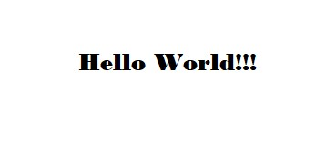
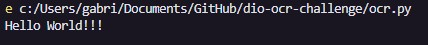

# Dio ocr challenge

Esse repositório contém o código criado para o desafio da DIO. Para revolvê-lo, utilizou-se a liguagem de Python, e as libs Open CV e Tesseract.

## Input

Esta foi a imagem utilizada para reconhecimento:

## Output

Esse foi o resultado no console do VSCode, após a execução do Script em Python:

## Processo: 

1. Foi criado um script em python para reconhecer textos em imagens.
2. Configurou-se a linguagem para inglês.
3. Foi fornecida uma imagem de amostra para reconhecimento.
4. O script foi executado.
5. O resultado obtido foi documentado.

## Conhecimento aprendido

Conhecimento fundamental de OCR usando Python, Open CV e Tesseract. 